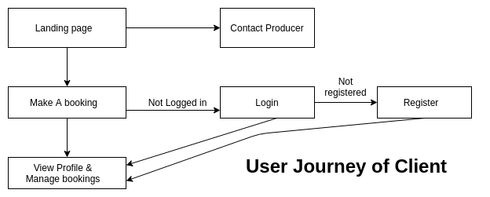
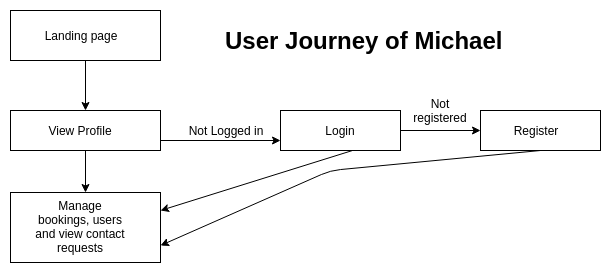
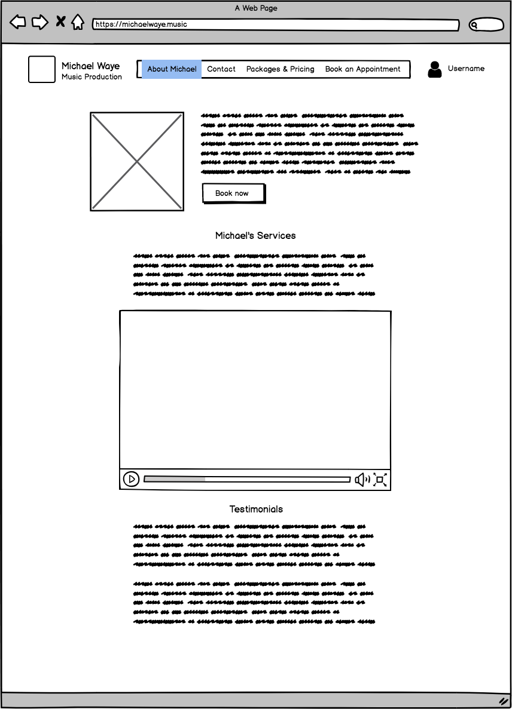
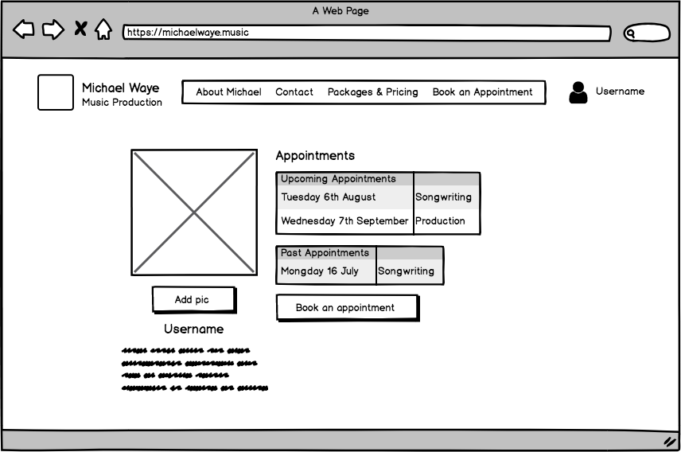
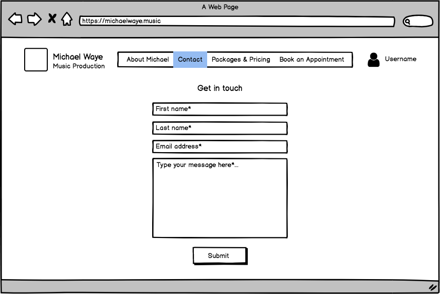
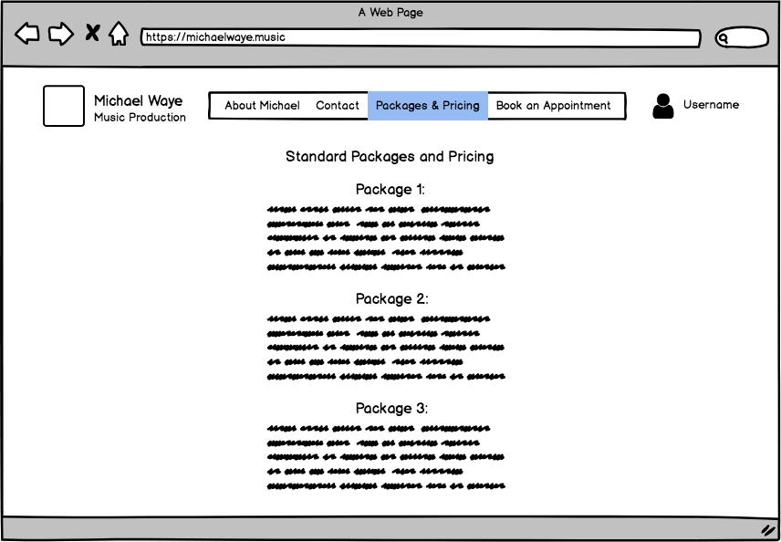
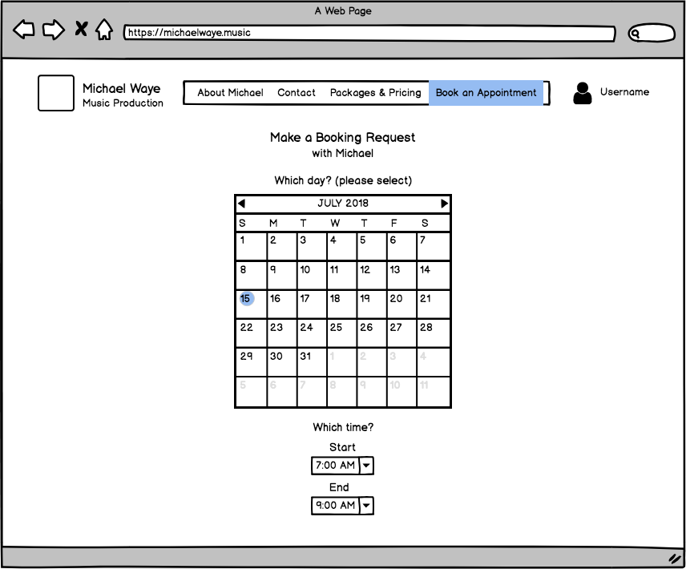
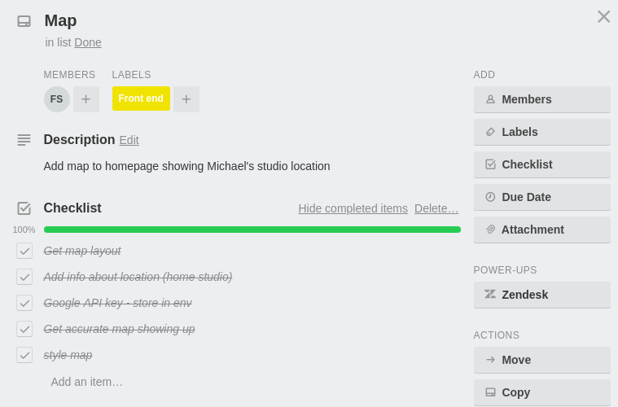
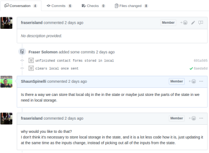

# Michael Waye Productions Booking Application

Below is the documentation for Michael's Production booking platform that was created as part of assessment for Coder Academy.

This application was created by [Caroline Evans](https://github.com/CaroEvans), [Fraser Solomon](https://github.com/fraserisland), [Shaun Spinelli](https://github.com/ShaunSpinelli) and [Isaac Powell](https://github.com/DeezyE) under the [GWSS](https://github.com/Global-Worldwide-Synergetic-Solutions) orginisation.

The site can be viewed [here](https://suspicious-bhabha-21b6a1.netlify.com/) and the back end is being hosted [here](https://mikewserver.herokuapp.com) by heroku.

## Table of Contents

- [Summary](#summary)
  - [Problem Definition](#problem-definition)
  - [Solution](#solution)
- [Application Design](#application-design)
  - [Conceptual Design and Review](#conceptual-design-and-review)
  - [User Stories](#user-stories)
  - [User Journeys](#user-journeys)
  - [Wire Frames](#wire-frames)
- [Project Management](#project-management)
  - [Working with the Client](#working-with-the-client)
  - [Manage Project](#manage-project)
  - [Team Management](#team-management)
  - [Post Project Review](#post-project-review)
- [Project Management Tools](#project-management-tools)
  - [Trello](#trello)
  - [Github](#github)
  - [Agile](#agile)

## Summary

### Problem Definition

Our client is Michael Waye, a local musician and producer. Currently Michael collects appointment details by phone and social media, keeping track of upcoming appointments in Google Calendar and saving customers details in his phone contacts.This as many issues such has .....

### Solution

The client needs a place online where customers can get an idea of his music writing and production services, contact him and book appointments.

Broken down into features, the client should be able to:

- Log in and out of their account securely

- Update the information displayed (MVP+)

- View, accept, decline and cancel appointments

- View their calendar of upcoming and past appointments

- Edit their available appointments (MVP+)

While customers should be able to:

- Create an account with their email address (Google and  Facebook are MVP+)

- Log in and out of their account securely

- Get an idea of our client’s services

- View our client’s contact details

- Make and cancel bookings (within a reasonable time frame)

- Receive a confirmation message for each booking

## Application Design

**Overview**

### Conceptual Design and Review

Review the conceptual design with the client and edit based on their feedback

### User Stories

[Link To Trello Board](https://trello.com/c/e1WejkLj/4-receive-a-confirmation-email-with-all-details-when-booking-confirmed-by-producer)

### User Journeys

### Wire Frames

[Wire Frames](https://balsamiq.cloud/s6j7lng/pwumg1f)

**About**

**Account**

**Contact**

**Packages**

**Sign Up**

**Booking**

## Project Management

Below is an overview on how the project was managed.

### Working with the Client

Meetings were held periodically with the client to ensure contsant communication and feedback during development.

**Meeting Checkpoints**

6 July: Found our client. Asked him about potential problems with how he intends to set up his music consultancy business. We learnt that he did not have a website and no way to easily keep track of his clients and their appointments.

Showed client our user flow diagram and basic wire frames and he approved them.

10 July:

12 July: Showed client 3 logo concepts, he selected one. Approved layout and design mockup.

22 July: took photos and videos of client.

24 July: Got client to user test app, his feedback:

> Contact form should also have fields for these questions:
>1) Do you have an idea of what style of music you’d like to create?
>2) Can you play an instrument, if so, please list those instruments
>3) Are you looking to record stylised covers?
>4) Do you have your own lyrics, chord structure or any other musical elements? If not just leave blank

> wants to go to clients, not for them to come to him.

### Project Charter

### Project Schedule

### reassess project scope

### Team Management

Roles where divided based on skill set, availability and interest in certain areas.

**Fraser** - Front end development direction, styling, API integration, Test design- front end

**Caroline** - Design Direction, front end development,client relations, Authentication and authorization on the server and client.

**Shaun** - Server side development, Dev Ops, CI & CD, Test design- back end ,Front end when needed.

**Isaac** - Security and data, documentation, Quality and user testing, Front end when needed.

Work was monitored through Trello. See [Trello](#trello) for more information.

### Post Project review

### Questionnaire from client

## Project Management tools

### Trello

[Board](https://trello.com/b/OFAmrk4Z/producer-app)

Trello was used  to divide tasks, prioritise them and estimate how long they will take to complete. This is achieved through Backlog, To Do, In Progress, Done and Approved cards. Each card was assigned to specific team member who would complete them. Each card also had a check list of related jobs that needed to be fnished in order for the card to be completed.

**Card Example**

### Github

An organization was created on github under Global-Worldwide-Synergetic-Solutions. In there we have the master repository for our client and server application, these will serve as the production source code for the project. Team members will fork from these repositories and create feature branches from their fork.

Each feature being developed will be on a feature branch, when done merge with your fork , then open pull request on master.

For back end, ensure all continuous integration tests pass on your fork before opening a pull requests.

For front end  after making a pull request another team member will do a code review to make sure everything looks good then accepts the pull requests and merges with master.

**Feature Branches**

Shaun - [back end](https://github.com/ShaunSpinelli/mikew-server/branches), [front end](https://github.com/ShaunSpinelli/mikew-client/branches)

Fraser -  [front end](https://github.com/fraserisland/mikew-client/branches)

Caroline - [back end](https://github.com/CaroEvans/mikew-server/branches), [front end](https://github.com/CaroEvans/mikew-client/branches)

Isaac - [front end](https://github.com/DeezyE/mikew-client)

### Agile

Our Agile Approach was based on for values:

- Individuals and Interactions over processes and tools

- Working Software over comprehensive documentation

- Customer Collaboration over contract negotiation

- Responding to Change over following a plan

We conducted daily stand ups on Slack where we share what our focus is for that day, usually picking 1 or 2 user stories to work on and what roadblocks we are facing. We also use Trello to divide tasks, prioritise them and estimate how long they will take to complete. This is achieved through Backlog, To Do, In Progress, Done and Approved cards. We again use Slack to communicate with each other throughout the planning, design and development process.

A call between two colleagues over slack.

Another aspect of our project that makes it more agile is that we have a continuous integration and deployment pipeline set up. So we can respond to change and these new features can be quickly test, merged and deployed to the website automatically.

When a team member makes a pull request on master for the client side we get a notification slack. We can review all the changes live in a deployed preview that Netlify automatically builds on pull requests before merging the changes.

Code Review where done on pull requests and also in person.

